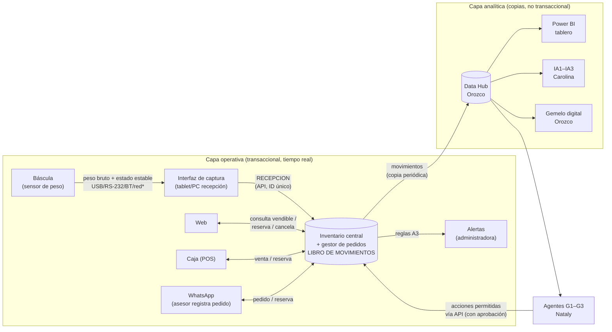

# Arquitectura tecnológica propuesta — Chickenmart

**[PROPUESTA]** Nada de esto está instalado. Las marcas/plataformas concretas quedan **[PENDIENTE]** hasta conocer la web y la caja actuales y la cotización de Carolina.

## Diagrama

\* Protocolo por verificar con el proveedor de la báscula.

**Regla de oro:** el **inventario central** es la única fuente de verdad para vender. El **Data Hub/Power BI** solo lee copias para analizar; nunca se vende ni reserva desde el tablero.

## Qué guarda cada componente, cómo comunica, permisos y sin conexión

| Componente | Qué guarda | Cómo comunica | Quién tiene permisos | Sin conexión |
|---|---|---|---|---|
| **Báscula** | Nada persistente (lectura instantánea; tara configurada) | Salida de datos a la interfaz (protocolo **por verificar**) | Auxiliar de recepción la opera; calibración por técnico | Sigue pesando; se lee en pantalla y se digita como "manual" |
| **Interfaz de captura** | Cola local de capturas pendientes (ID, SKU, lote, neto, responsable) | Envía `RECEPCION` al inventario por API/HTTPS | Auxiliar crea capturas; no puede corregir confirmadas | Guarda en cola y reenvía al reconectar; el central ignora duplicados |
| **Inventario central + gestor de pedidos** | Productos, lotes, **movimientos**, pedidos, reservas, alertas | API para canales; exportación a Data Hub | Admin: correcciones, umbrales, bloqueos · Canales: reservar/vender · Auxiliar: recepciones | Es el núcleo: requiere hosting confiable y respaldo; si cae, canales pasan a modo contingencia |
| **Web** | Catálogo y carrito (sin stock propio) | Consulta vendible y crea reservas vía API/conector | Clientes (vía web); admin web | No promete stock: "por confirmar" |
| **Caja (POS)** | Ventas del día | Registra ventas/salidas en el central | Cajero | Límite conservador + conciliación posterior |
| **WhatsApp** | Conversación (no es registro de inventario) | Asesor registra pedido en el gestor | Asesor | Sin registro en gestor no hay reserva |
| **Alertas (A3)** | Alertas con estado | Correo / WhatsApp interno / panel | Administradora configura y atiende | Quedan pendientes en el panel |
| **Data Hub** | Copia histórica de movimientos, pedidos, alertas | Carga periódica desde el central | Orozco/analistas: solo lectura del central | No afecta la venta; se actualiza al reconectar |
| **Power BI** | Modelos e indicadores | Lee del Data Hub | Gerencia/administradora: lectura | Muestra último corte |
| **IA / Gemelo** | Modelos, simulaciones | Leen Data Hub; proponen, no ejecutan | Carolina / Orozco | No afecta la operación |
| **Agentes G1–G3** | Registro de acciones propuestas/ejecutadas | API del central, solo acciones permitidas | Nataly define permisos; acciones sensibles requieren aprobación | Se detienen; no actúan sobre datos viejos |

## Eventos que actualizan el Data Hub y el gemelo (→ Orozco)

`RECEPCION`, `AJUSTE`, `RESERVA`, `LIBERACION`, `SALIDA`, `BLOQUEO`, `MERMA`, `TRANSFORMACION` (fraccionamiento, propuesto), `ALERTA_CREADA`, `ALERTA_ATENDIDA`.
Campos comunes: `mov_id, tipo, sku, lote_id, delta_fisico, delta_reservado, delta_bloqueado, unidad, canal, pedido_id, responsable, momento, clave_unica, ref_mov_id, detalle`.
Esquema y ejemplo: `demo/evidencia/esquema.sql` y `demo/evidencia/movimientos.csv`.
